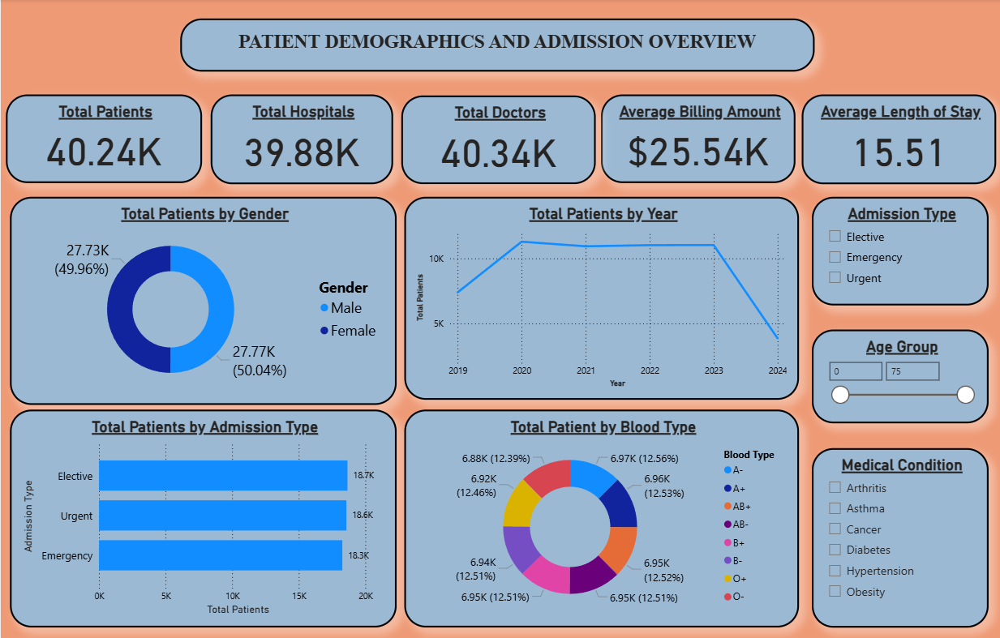
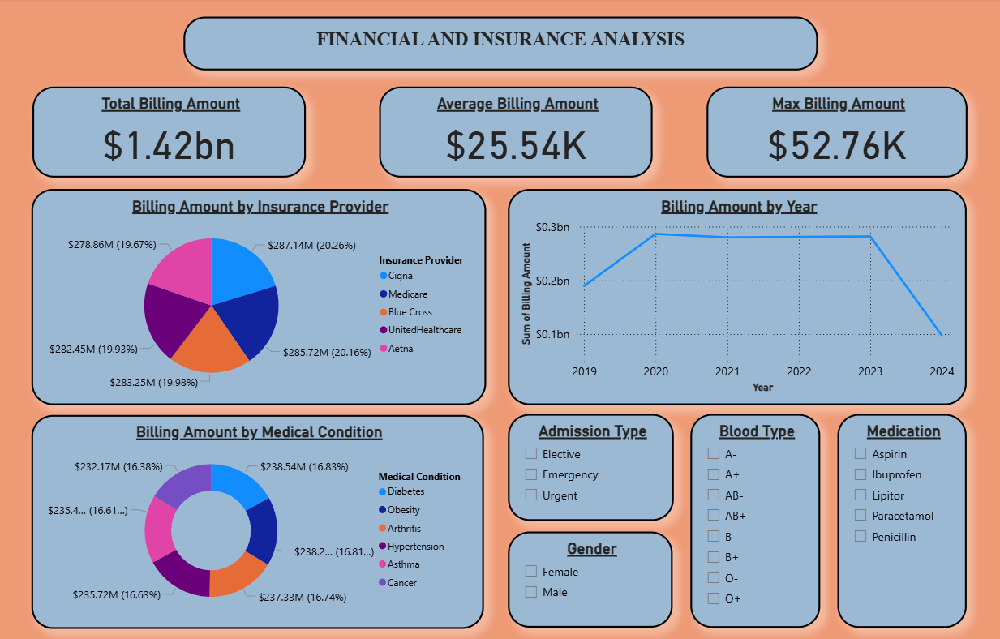
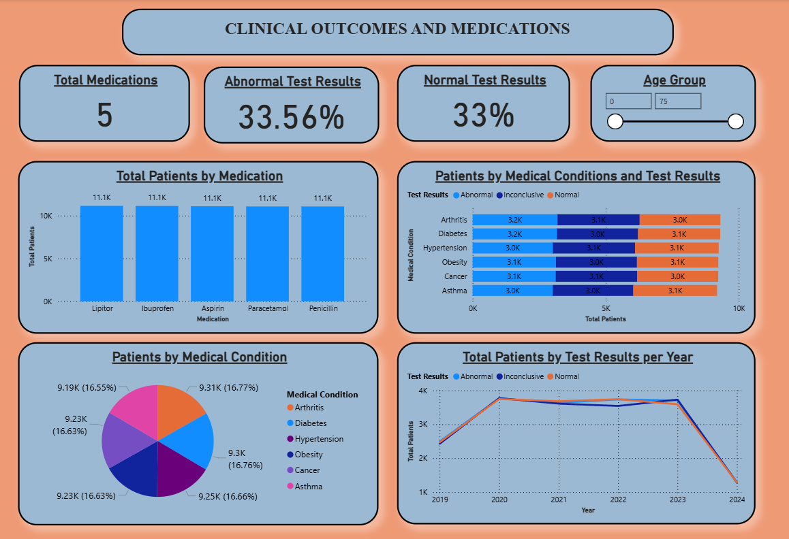
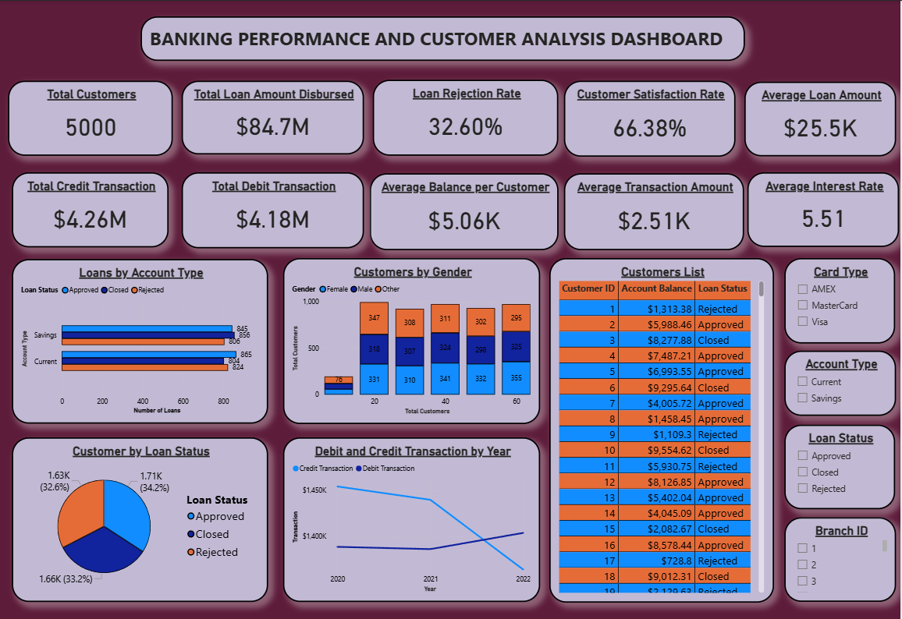

# 🧠 Power BI Small Projects

This repository contains two interactive Power BI dashboards developed for **Healthcare Analysis** and **Banking Performance & Customer Analysis**.  
Each project demonstrates data visualization, storytelling, and analytical insights using real-world datasets from **Kaggle**.

---

---

## 🏥 Healthcare Analysis Dashboard

### 📘 Dataset Description
The **Healthcare Dataset** from Kaggle contains records of patients, test results, and healthcare metrics such as medical costs, satisfaction rates, and disease trends.  
The goal is to provide insights into **patient demographics, hospital performance, test trends, and cost distribution** across multiple years.

---

### 📊 Page 1 — Overview and Key Metrics

**Explanation:**  
This page provides an overall summary of the healthcare system’s performance — including total patients, total costs, average satisfaction, and test result trends.  
Interactive filters allow users to analyze data across years, hospitals, and test types.

---

### 📉 Page 2 — Financial and Insurance Analysis

**Explanation:**  
This section explores **financial patterns** such as hospital revenue, cost recovery, and insurance coverage analysis.  
KPIs display the financial stability and growth, while bar and donut charts show patient insurance type and claim status distributions.

---

### 📈 Page 3 — Yearly Test Result Trends

**Explanation:**  
A line chart tracks test results across years, separated by different test categories.  
This helps visualize performance improvements, identify anomalies, and highlight significant changes in healthcare outcomes.

---

## 🏦 Banking Performance & Customer Analysis Dashboard

### 📘 Dataset Description
The **Comprehensive Banking Database** from Kaggle contains customer demographic information, product usage, financial transactions, and regional performance indicators.  
The dashboard is designed to help understand **customer segmentation, regional banking performance, and product-based profitability**.

---

### 📊 Page 1 — Customer and Financial Performance Overview

**Explanation:**  
This page presents a holistic view of banking operations — including customer segmentation, deposits, loans, and product adoption metrics.  
Interactive visuals highlight customer loyalty, transaction value distribution, and branch performance to guide data-driven decision-making.

---

## ⚙️ Tech Stack

- **Power BI Desktop**
- **CSV Data (Kaggle Datasets)**
- **Data Modeling and DAX Calculations**
- **Dynamic Filters, KPIs, and Drill-through Visuals**

---

## 📜 Summary

These Power BI projects demonstrate:
- Data cleaning and model creation using CSV datasets  
- Visualization of complex relationships through interactive dashboards  
- Insight generation for better decision-making in healthcare and banking sectors

---

### 💡 Author
**Pranav Agwan**  
Data Science & Analytics Enthusiast  
📧 [Your Email or LinkedIn Here]

